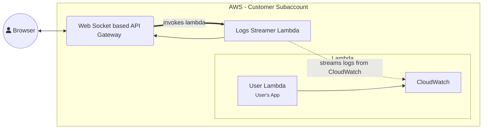
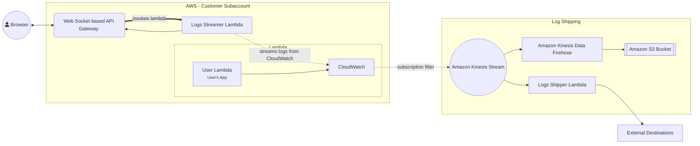
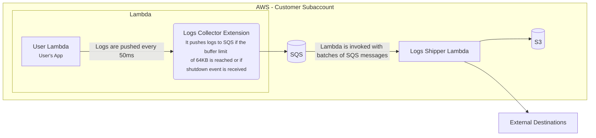
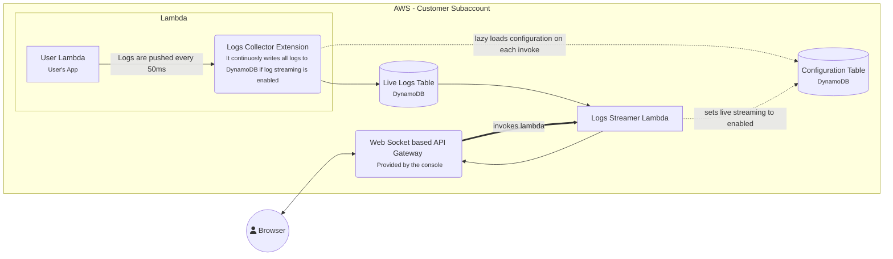

# Brief intro

This is my first blog post in what I hope to be a series of blog posts about the some of the more interesting work I've done and things I've learnt. In this post, I'll be talking about how I managed to to achieve **more than 90% savings in the cloud spend** for a specific area of the product at Edgio. These changes allowed [Edgio](https://edg.io/applications/sites/) to save hundreds of thousands of dollars for log shipping across all our customers. I hope it serves as an inspiration for others to look deeper into their cloud architecture and find similar opportunities.

# What are Cloud Functions?

[Cloud Functions](https://edg.io/applications/sites/) (also known as "Sites") is an Edgio feature that allows customers to host serverless Node.js applications, commonly Next.js apps, but it supports virtually any type of Node.js app. While the platform is complex with many components, this blog post will focus on the log shipping and streaming feature.

The system must achieve two primary goals related to logs:

1. Real-time or fast streaming of logs to the console (customer facing dashboard).
2. Shipping logs to external log providers or archival storage.

# Basic architecture

Before diving into the optimizations, it's important to understand the existing architecture for log shipping and streaming. The following diagram illustrates the cloud infrastructure setup for handling logs before any optimizations were made:

#### Data Flow

1. When an end-user goes to the edgio console and starts log streaming for one of their deployments, their browser makes a websocket connection to AWS API gateway.
2. The API gateway invokes the Logs Streamer Lambda which starts up and streams logs from CloudWatch. In practice, it had to stream logs at least 10 seconds in the past because if you query for any more recent logs, there is a chance of missing logs which are not processed yet by CloudWatch. 
3. As it detects new logs from CloudWatch, it pushes the logs to the web socket connection via API gateway.
4. The console UI receives the logs via web socket and displays them in the UI. 

This architecture already fulfills requirement 1 which is to enable real-time streaming of logs but I needed to also fulfill the second requirement to ship logs to external destinations. 

The first proposed design was an extension of the same system:

This design uses the [best practices](https://aws.amazon.com/blogs/architecture/stream-amazon-CloudWatch-logs-to-a-centralized-account-for-audit-and-analysis/) and would be very scalable and easy to maintain once setup. 

### Safe, standard, but costly

BUT, here's why I felt unsatisfied with the whole architecture. I was going through the cloud spend for one of our enterprise accounts and it almost caused me physical pain to see that we were paying $10,000+ just for CloudWatch data processing fees per month. We were not even using CloudWatch to query the logs, setup alerts or collect metrics. CloudWatch was literally just the default medium of transport and it pained me to see that it cost so much. 

# Rethinking the whole architecture

I stepped back a little bit and questioned whether we could find some other medium of collecting and transporting logs that was cheaper than using CloudWatch. The solution had to support both the real-time log streaming usecase and the log shipping usecase, and the added complexity of any other solution would be clearly worth-it only if I could reduce costs by 40% or more. The performance must also not degrade for the existing real-time log streaming feature. 

### Collecting Logs using Lambda Extensions

I started researching alternate ways to collect the logs from the lambda function and came across a very powerful feature called [Lambda Extensions](https://docs.aws.amazon.com/lambda/latest/dg/lambda-extensions.html). In short, a Lambda Extension is a piece of software that you can inject into the Lambda function which shares the resources of the lambda but can have a more extended lifetime. More importantly, it has access to some exclusive APIs including the logs API which delivers logs generated from the main lambda process to the Lambda Extension. 

_Overview of Lambda Extensions Lifetime_

The lambda extension I wrote is quite simple. On startup, it subscribes to the [Lambda Logs API](https://docs.aws.amazon.com/lambda/latest/dg/runtimes-logs-api.html#runtimes-logs-api-subscribing) and starts a web server that can receive requests from AWS about Lambda events and Log events. It can then process those logs, buffer them and send them anywhere else. This API is free to use. 

Now once we have the logs in the lambda extension, now it is time to push those logs to somewhere else. 

I looked at some existing lambda extensions that ship logs from the lambda to external sources, for example the [Sumologic lambda extension](https://github.com/SumoLogic/sumologic-lambda-extensions). But the problem with all of the existing lambda extensions I saw was that they block the suspension of lambda until they get the last bit of logs from the lambda execution and then send it over to some external destination. Testing with Sumologic extension, it was often adding a delay of 500-1000ms to ship logs which is extra billed lambda usage. This will cost too much. We needed something with a less overhead. 

In order for the lambda extension to not add any additional increase in billed duration, it needs to not delay the lambda suspension and send logs to a destination with as little latency as possible. I chose SQS for this because pushing a message to SQS is almost instantaneous from within a lambda, the service is quite cheap, is almost inifinitely scalable, and you only pay for usage. 

### New Architecture for Log Shipping

In our log shipping usecase, we didn't have a strict latency requirement. If it took up to a few minutes for logs to be shipped, that was acceptable. So, to further minimize the cost of SQS, the lambda extension removes sensitive data from logs and buffers the logs until either a certain amount of time has passed since last push or until 64KB of logs is accumulated. 64KB is the maximum payload of an SQS message and your cost of SQS usage is the same whether you are sending 1KB or 64KB so it makes sense to make the most out of that quota and send as few messages as possible. 

Once the logs are in SQS, the rest is simple. There is a Logs Shipper Lambda that is setup to be invoked by SQS with a batch of messages. That lambda is also invoked either after a time limit or after accumulating enough messages to make a full batch. That lambda simply has code to compress the logs and send those logs to multiple external destinations simultaneously. 

Here's the updated architecture:

This architecture has a few problems like variable latency depending on the amount of logs generated (latency is reduced for high throughput of logs, and latency could be quite high for low throughput) but it cannot be argued that this architecture is extremely cheap. The main cost components are SQS and the logs shipper lambda. If we're just comparing cost of the logs shipping medium, to ship the same amount of logs, SQS gives us a cost saving of over 95%. It is practically free compared to CloudWatch!

## Real-time Log Streaming

The above architecture is quite cheap compared to the previous architecture with practical savings in the range of 90-95% compared to before. But with its variable latency, it is not suitable at all for log streaming. For that, I had to come up with a separate pipeline.

Real-time streaming is used by our customers to stream logs for their deployed websites right in the developer console. Therefore, it is important to ship all the logs for a request out of the lambda extension before the response is sent and the lambda runtime is suspended, otherwise the developers would be left with incomplete logs and each new request would bring logs from previous requests. 

Making our lambda extension delay the suspension of the lambda worker was unacceptable for two reasons. The first being that any additional time would be billed and cut into the savings. The second and more important reason was that we execute the lambda using a synchronous invocation with `LogType: Tail`. When you specify that option, the lambda API gives you back the response not when the lambda code itself has returned a response but when the response has been sent and the lambda extension has signalled that it is finished with its processing. That would mean any additional delay on receiving logs and sending them to SQS would also increase the response latency to the end users. 

So, I came up with an architecture that adds the required delay (about 30-80ms in practice) **only** when someone was actually streaming the logs in the console. Otherwise, there is no additional delay or cost. That delay is unfortunately necessary because the logs are not available in the lambda extension until the lambda has finished executing. Later, we moved away from using the `LogType: Tail` and so the delay no longer causes any additional latency for the end users.

Here's the new architecture.

### How it works

In the new architecture, we use one dynamodb table as a temporary but fast medium for log streaming and we use another dynamodb table to store some configuration.

When one of our users goes to the dashboard to one of their deployments and starts the log streaming process, their browser makes a request to a special API gateway URL and connects via websocket to the API gateway. The API gateway in turn invokes a logs streamer lambda.

When the logs streamer lambda starts up, it sets a configuration in the configuration table that enables log streaming for a certain deployment.

Meanwhile, on each invokation/request, the lambda extension lazily checks the configuration and if it finds that log streaming is enabled for that deployment, it starts sending each log line to a dynamodb table in real-time without any buffering. On the other side of the equation, the log streamer lambda can just read logs as they are written in the dynamodb table and send those logs to the API gateway websocket connection. Log streaming is always enabled with a deadline and the log streamer lambda disables log streaming when the web socket connection is closed.

This system works brilliantly because it activates only when needed and turns off automatically as soon as it is not needed anymore. Using dynamodb as a fast logs medium allows us to use an extremely fast, very cost-effective, highly scalable system that we can pay only for usage. Even better is that querying CloudWatch for logs less than 10 seconds old often lead to missed logs. But the dynamodb table allowed us to confidently stream logs in real-time instead of with a 10 second delay with CloudWatch. 

There is a cost for checking the configuration table for whether or not log streaming is enabled but with some debouncing and caching, the cost remains in single digits even for our larger customers and there is almost no noticeable cost for using the log streaming table because the feature is used sparingly. 

# Conclusion

The cloud is also a casino. You can often not predict what the bill is going to be like at the end of the day and there are almost always unexpected costs. In this case, the cost of CloudWatch was very high for our usecase and by thinking out of the box, I managed to come up with a new architecture that achieved hundreds of thousands of dollars in cost savings for the company per year. 

The new architecture is a bit more complex than before, and is suitable perhaps only for Edgio but it demonstrates the fact that if you start digging deeper within your cloud architecture, you might just uncover similar opportunities and save big on cloud spend!
